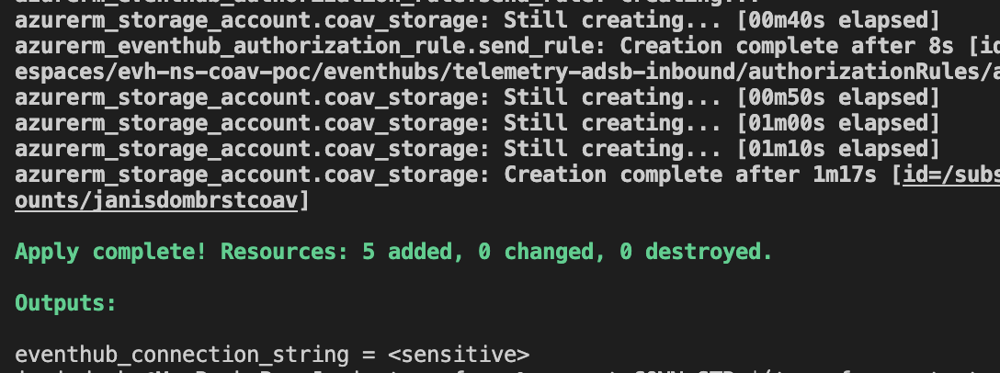
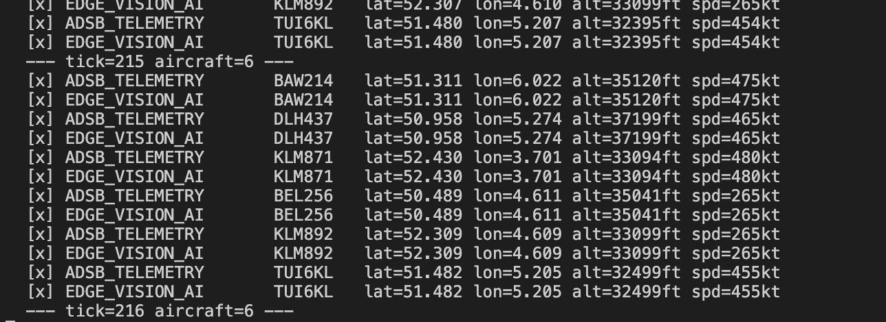
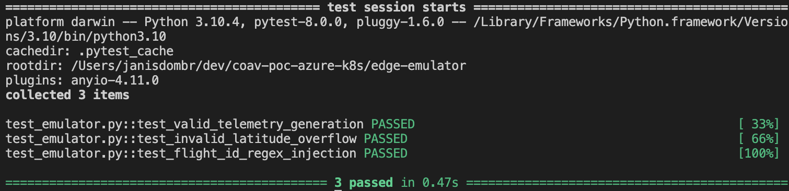
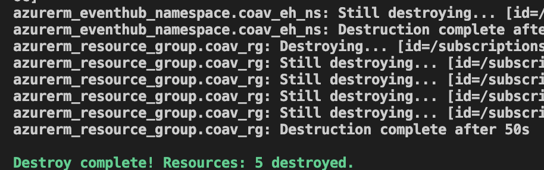
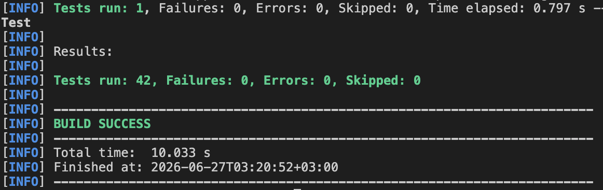
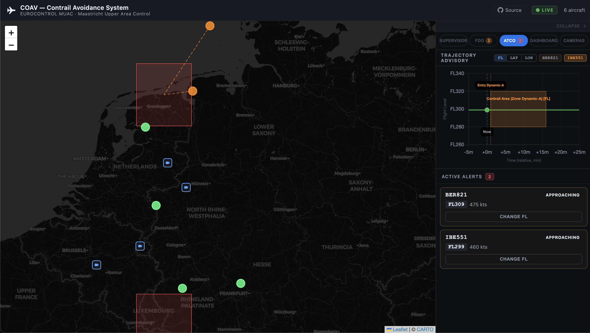

# COAV — Contrail Avoidance System (PoC)

EUROCONTROL MUAC · Contract ECTL_SRC_260028

**Live demo:** [Backend Readme.md](`https://coav.dombrovski.lv`)

API url: `https://coav-backend.victoriouscliff-165b8274.westeurope.azurecontainerapps.io/api/flights`
_(URL printed by `terraform output demo_url` after cloud deployment)_

---

## Architecture

```
[Raspberry Pi / ACI]               [Azure]                         [ATC Operator]
  edge-emulator/emulator.py  →  Event Hub (telemetry-adsb-inbound)  →  Vue 3 GUI
  edge-pi/node/capture.js    ↗  Spring Boot backend                     Leaflet map
                                 FlightStateStore (5-min TTL)            Chart.js
                                 WebSocket /topic/flights                AlertPanel
                                 POST /api/correction
```

**ISSR zones — single source of truth in `FlightStateStore.ISSR_ZONES`:**
- Zone Alpha: lat 50.20–51.00, lon 3.80–5.40, FL330–FL380 (Brussels convergence)
- Zone Bravo: lat 51.30–52.50, lon 5.80–8.20, FL310–FL370 (Dutch-German border)

---

# LOCAL DEVELOPMENT & TESTING

## Prepare env (install terraform, python3, azure cli. See installation instruction for your OS) and auth with Azure

```sh
brew install terraform
brew install python
cd edge-emulator
pip3 install -r requirements.txt
cd ..
brew install azure-cli
az login
```

## Create terraform/main.tf for test infrastructure and deploy it

```sh
cd terraform
terraform init
terraform apply
```


## After success put connection string to CONN_STR env

```sh
export CONN_STR=$(terraform output -raw eventhub_connection_string)
```

## Start emulating (edge-emulator/emulator.py)

The emulator generates **7 aircraft**: 4 transit corridors (BAW/DLH/KLM/AFR families),
2 holding stacks (BEL256 Brussels DENUT / KLM892 Amsterdam SUGOL), 1 departure (TUI6KL).
Each transit flight keeps its callsign for the full route crossing, then a new callsign
starts the same corridor after a gap — no synchronized 5-minute resets.

```sh
cd ../edge-emulator
python3 emulator.py
```


## Creating OWASP tests and pass it

```sh
pytest -v
```


## Destroy terraform stack to save money (after all next steps)

```sh
cd ../terraform
terraform destroy -auto-approve
```


## Next step - backend -->
[Backend Readme.md](backend/Readme.md)

## After backend test try Databricks

```sh
cd databricks
terraform init
terraform apply
```

## After creating all resources we need to run job using Databricks CLI
## install if needed
```sh
brew tap databricks/tap
brew trust databricks/tap
brew install databricks
export DATABRICKS_AUTH_TYPE="azure-cli"
```
## run (just run it if you have installed jq already)

```sh
WORKSPACE_RESOURCE_ID=$(terraform output -raw -state=../terraform.tfstate databricks_workspace_id)
DATABRICKS_HOST="https://$(az resource show --ids "$WORKSPACE_RESOURCE_ID" --query "properties.workspaceUrl" -o tsv)"
export DATABRICKS_HOST
SUBSCRIPTION_ID=$(echo "$WORKSPACE_RESOURCE_ID" | cut -d'/' -f3)
TENANT_ID=$(az account list --query "[?id=='$SUBSCRIPTION_ID'].tenantId" -o tsv)
DATABRICKS_TOKEN=$(az account get-access-token \
  --tenant "$TENANT_ID" \
  --scope "2ff814a6-3304-4ab8-85cb-cd0e6f879c1d/.default" \
  --query "accessToken" \
  -o tsv)
unset DATABRICKS_AUTH_TYPE
export DATABRICKS_TOKEN
JOB_ID=$(databricks jobs list --output JSON | jq -r '.[] | select(.settings.name == "Run Coav Stream Processing") | .job_id')
databricks jobs run-now "$JOB_ID"
```
## return back to classic auth
```sh
unset DATABRICKS_TOKEN
export DATABRICKS_AUTH_TYPE="azure-cli"
```

---

## GUI Backend — Java Spring Boot

### Two modes: `mock` (no Azure) or default (reads live from Event Hub).

> **Note:** local Docker runs (`mock` and `Azure mode`) use Docker Desktop — do **not** activate
> the minikube Docker context for these. If you previously ran `eval $(minikube docker-env)`,
> reset it first: `eval $(minikube docker-env -u)`

## Build the image (Docker Desktop, one-time)

```sh
docker build -t coav-gui-backend:v1 ./coav-gui/backend
```

## Mock mode — built-in simulator, no credentials needed

```sh
docker run -d -p 8080:8080 -e SPRING_PROFILES_ACTIVE=mock --name coav-backend coav-gui-backend:v1

curl http://localhost:8080/api/flights
curl http://localhost:8080/api/issr-zones
```

## Stop when done
```sh
docker stop coav-backend && docker rm coav-backend
```

## Azure mode — live Event Hub data

```sh
export CONN_STR=$(cd terraform && terraform output -raw eventhub_connection_string)
docker run -d -p 8080:8080 -e CONN_STR="$CONN_STR" --name coav-backend coav-gui-backend:v1

curl http://localhost:8080/api/flights
```
## Stop when done
```sh
docker stop coav-backend && docker rm coav-backend
```

## Deploy to Minikube cluster (Azure mode)

The minikube Docker context is required here so the image is built inside the cluster node.

```sh
eval $(minikube docker-env)
minikube image build -t coav-gui-backend:v1 ./coav-gui/backend

# Create secret (skip if already exists from a previous deploy)
kubectl create secret generic coav-secrets --from-literal=eventhub-cn="$CONN_STR"

kubectl apply -f k8s/coav-gui-backend-deployment.yaml

# Forward cluster port to localhost
kubectl port-forward svc/coav-gui-backend-svc 8080:8080

curl http://localhost:8080/api/flights
```

Full command reference → [coav-gui/backend/README.md](coav-gui/backend/README.md)

## Run backend tests (43 tests, no Maven install needed)

```sh
docker run --rm -v "$PWD/coav-gui/backend":/build -w /build \
  maven:3.9-eclipse-temurin-21-alpine mvn test
```


## Vue 3 Frontend — local dev

Requires the backend running on :8080.

```sh
cd coav-gui/frontend
npm install   # once
npm run dev   # → http://localhost:5173 (proxy /api and /ws → :8080)
```



---

# CLOUD DEPLOYMENT (Azure Container Apps)

Full always-on deployment with public HTTPS URL for the demo.
All three services run in Azure: emulator (ACI) + backend (Container App) + frontend (Container App).

> **ACR is private.** Only authenticated Azure identities can push/pull images.
> `admin_enabled = true` creates a technical user for Container Apps/ACI — it does NOT make
> images publicly accessible.

## Deploy — single command

Requires `terraform/main.tf` already applied (Event Hub must exist).
Docker Desktop must be running and `az login` completed.

```sh
cd terraform/app
terraform init
terraform apply
```

`terraform apply` does everything in order automatically:
1. Registers Azure providers (`Microsoft.App`, `Microsoft.ContainerRegistry`, etc.)
2. Creates ACR, Log Analytics, Container Apps environment
3. Creates Container Apps with a public placeholder image (avoids chicken-and-egg problem)
4. Builds all 3 Docker images locally and pushes them to ACR
5. Updates Container Apps with real images via `az containerapp update`
6. Creates ACI emulator (image is now in ACR)

## Get the demo URL

```sh
terraform output demo_url
```

Share this HTTPS URL. The frontend proxies `/api` and `/ws` to the backend automatically.

## Update after code changes

Force a full rebuild (all 3 images):

```sh
terraform apply -replace=null_resource.build_and_push
```

Or rebuild a single image manually:

```sh
az acr login --name acrcoavpoc
docker build -t acrcoavpoc.azurecr.io/coav-backend:latest ./coav-gui/backend
docker push acrcoavpoc.azurecr.io/coav-backend:latest
az containerapp update --name coav-backend --resource-group rg-coav-poc-prod \
  --image acrcoavpoc.azurecr.io/coav-backend:latest
```

## Teardown cloud deployment

```sh
# GUI + emulator + ACR
cd terraform/app && terraform destroy -auto-approve

# Event Hub + Storage + Databricks
cd terraform && terraform destroy -auto-approve
```

---

## API reference

| Method | Path | Description |
|--------|------|-------------|
| GET | `/api/flights` | Active flights (5-min window, sorted newest first) |
| GET | `/api/issr-zones` | ISSR zone definitions (ALPHA + BRAVO) |
| POST | `/api/correction` | FL correction — OWASP A03 validation, broadcasts to `/topic/corrections` |

**WebSocket topics (STOMP over SockJS `/ws`):**
- `/topic/flights` — live flight state, pushed every 2 s
- `/topic/corrections` — ATC instruction acknowledgement

**Correction flow:** `POST /api/correction` validates input (OWASP A03), returns `CorrectionResult`,
and broadcasts the acknowledgement via WebSocket to `/topic/corrections`. It does **not** write to
Event Hub and does **not** modify the simulator trajectory (PoC scope). A production system would
publish to a second Event Hub entity (`atc-commands`) for the aircraft to consume.

---

## Event Hub architecture

Single namespace `evh-ns-coav-poc`, one hub entity `telemetry-adsb-inbound`.
Two message types filtered in Java by the `message_type` JSON field:

| `message_type` | Source | Consumed by |
|---|---|---|
| `ADSB_TELEMETRY` | emulator.py / edge-pi | EventHubListenerService → ADSB state map |
| `EDGE_VISION_AI` | emulator.py / edge-pi | EventHubListenerService → AI state map |

Stream join fires when both types arrive for the same `flight_id`.
EventHubListenerService starts from events enqueued within the last **15 minutes** to skip stale
historical data (`EventPosition.fromEnqueuedTime(now - 15 min)`).

---

## Project structure

```
coav-poc-azure-k8s/
├── terraform/
│   ├── main.tf / variables.tf       — Event Hub, Databricks, Storage
│   ├── databricks/                  — Databricks workspace + job
│   └── app/                         — Container Apps + ACR + ACI emulator (cloud deploy)
├── edge-emulator/
│   ├── emulator.py                  — Stateful 7-aircraft MUAC sim → Event Hub
│   └── Dockerfile
├── edge-pi/
│   ├── node/capture.js              — Node.js: USB webcam → Event Hub
│   └── python/capture.py            — Python: Pi Camera → Event Hub
├── backend/
│   └── main.py                      — Python K8s backend v1 (initial prototype; superseded by
│                                      coav-gui/backend once the Java requirement was found in the spec)
├── coav-gui/
│   ├── backend/                     — Java Spring Boot 3 (43 tests, mock + EventHub modes)
│   └── frontend/                    — Vue 3 + Vite + TypeScript
│       ├── Dockerfile               — nginx multi-stage, BACKEND_URL injected at runtime
│       └── nginx.conf               — serves /config.js with backend URL for direct browser calls
└── k8s/
    └── coav-gui-backend-deployment.yaml
```
