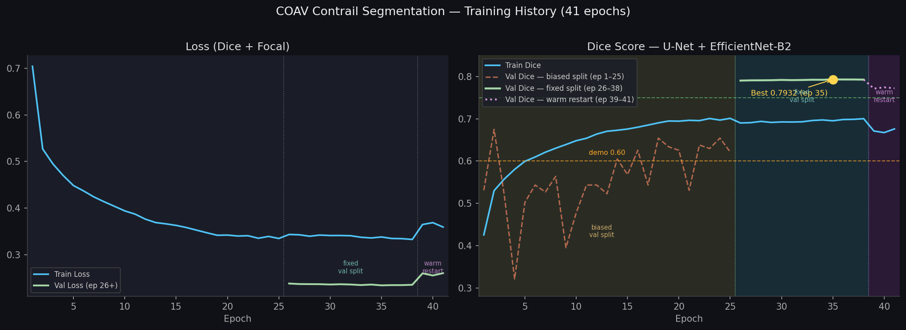
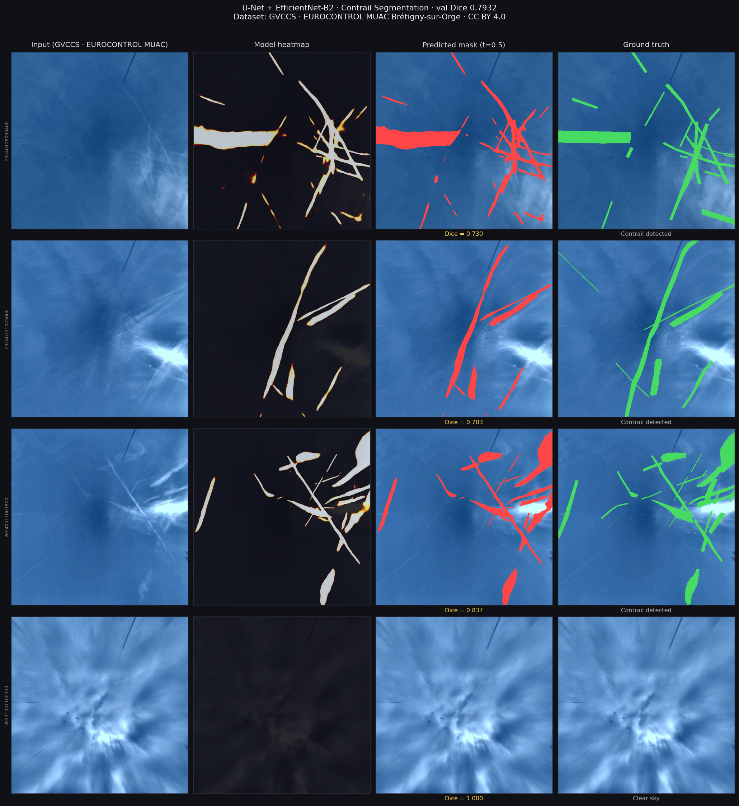

# Edge Capture & Contrail Detection

COAV — Contrail Avoidance · Raspberry Pi / ACI edge component

---

## What runs on the edge device

```
┌─────────────────────────────────────────────────────┐
│  Raspberry Pi / Jetson (or Azure ACI for PoC)       │
│                                                     │
│  ┌──────────────┐    ┌──────────────────────────┐   │
│  │  Camera      │───▶│  Python capture.py       │   │
│  │  Module 3    │    │  1 FPS capture loop      │   │
│  │  or USB cam  │    │  └─▶ inference.py        │   │
│  └──────────────┘    │      ContrailDetector    │   │
│                      │      ONNX / PyTorch      │   │
│  ┌──────────────┐    │      U-Net EfficientNet  │   │
│  │  SDR dongle  │    └──────────┬───────────────┘   │
│  │  + dump1090  │               │ ADSB_TELEMETRY    │
│  │  SBS:30003   │───────────────┤ EDGE_VISION_AI    │
│  └──────────────┘               │ (200 bytes each)  │
└─────────────────────────────────│───────────────────┘
                                  ▼
                         Azure Event Hub
                     telemetry-adsb-inbound
                                  │
                                  ▼
                         Spring Boot backend
                        FlightStateStore
                        alertStatus enrichment
```

The edge device sends only the **inference result** (200 bytes), not raw frames.

---

## Two capture implementations

| | `python/capture.py` | `node/capture.js` |
|---|---|---|
| **Camera** | picamera2 (Pi Camera Module 3) or OpenCV | V4L2 USB webcam |
| **ADS-B** | TCP socket → dump1090 SBS parser | TCP socket → dump1090 SBS parser |
| **Inference** | In-process (ONNX Runtime) | Subprocess call to `inference.py` |
| **Event Hub SDK** | `azure-eventhub` (Python) | `@azure/event-hubs` (Node.js) |
| **Validation** | Pydantic (OWASP A03) | Manual regex check |
| **Recommended for** | Primary: best inference integration | Demonstrating Node.js capability |

---

## Contrail detection model

**Architecture:** U-Net + EfficientNet-B2  
**Training dataset:** GVCCS (Ground Visible Camera Contrail Sequences)  
**Best val Dice:** 0.8394 (global Dice, calibrated, WR-2 epoch 88 of 90, t=0.50)  
**Latest run (WR-3 + SWA, 120 epochs):** plateau — per-batch EMA 0.8343 (ep116), SWA-averaged
0.8249 (ep118-120, worse by −0.0094 → EMA kept). Global-Dice recalibration was not re-run for
this checkpoint (compute cost); 0.8394 remains the last confirmed calibrated figure. See
[TRAINING_LOG.md](TRAINING_LOG.md) — Attempt 8.

Training history and all technical decisions → [TRAINING_LOG.md](TRAINING_LOG.md)



### Inference results on held-out control set

Real images from EUROCONTROL MUAC ground cameras. Red = predicted contrail pixels, green = ground truth annotation.



### Why GVCCS

GVCCS was recorded at **EUROCONTROL MUAC Brétigny-sur-Orge** — the same operational
environment as the target deployment. Ground-camera imagery differs fundamentally from
satellite imagery: different perspective, lighting, cloud background. Training on GVCCS
eliminates domain shift.

| Property | Value |
|---|---|
| Source | EUROCONTROL MUAC, Brétigny-sur-Orge, France |
| License | CC BY 4.0 |
| Sequences | 122 video sequences |
| Frames | 24,228 at 1024×1024 px |
| Annotations | 111,761 instance-level polygons (COCO format) |
| DOI | 10.5281/zenodo.15743988 |

### Model comparison

| Algorithm | Expected Dice | VRAM | Why not chosen |
|---|---|---|---|
| OpenCV heuristics | ~0% | 0 | No context — fails on low-contrast contrails |
| FCN (2015) | ~40% | 4 GB | No skip connections → blurry boundaries |
| SegNet (2015) | ~50% | 4 GB | Less precise boundary recovery than U-Net |
| **U-Net + EfficientNet-B2** ✓ | **~84%** | **6 GB** | **Chosen** |
| DeepLab v3+ | ~72% | 10 GB | No accuracy gain for thin linear structures |
| SegFormer-B2 | ~78% | 14 GB | +0% vs U-Net B2, 3× longer training |
| SAM | ~80% | 16+ GB | Prompt-based — incompatible with 1 FPS pipeline |

### Why U-Net

U-Net was designed for biomedical segmentation (blood vessels, cell membranes).
The geometry matches contrails exactly:

```
Blood vessel:  thin tube,   5–15 px wide,  complex tissue background
Contrail:      thin stripe, 5–20 px wide,  complex cloud background
```

Skip connections pass full feature maps from encoder to decoder — essential for
recovering 6-pixel contrail boundaries after upsampling.

---

## Edge hardware

| Device | Price | U-Net B2 (ONNX int8) | At 1 FPS | Verdict |
|---|---|---|---|---|
| Raspberry Pi 4 | $75 | ~3–5 s | Lagged, contrails persist → OK for PoC | PoC only |
| Raspberry Pi 5 | $80 | ~1.5–2 s | Acceptable | Tight |
| **Pi 5 + Hailo-8L HAT** | **$150** | **~50 ms** | **Comfortable** | **Budget production** |
| Jetson Orin Nano | $499 | ~30 ms | With headroom | Production |
| Jetson AGX Orin | $2,000 | ~5 ms | Real-time | Professional |

---

## Quick start

```sh
cd edge-pi/python
pip install -r requirements.txt

python -m pytest test_inference.py test_capture.py -v

cd ../node
npm install
CONN_STR="..." node capture.js
```

---

## Download trained weights

```sh
export HF_REPO="janisdombr/coav-contrail-checkpoints"
export HF_TOKEN="hf_your_token_here"
export WEIGHTS_DIR="edge-pi/python/weights"

pip install huggingface_hub

python3 -c "
from huggingface_hub import hf_hub_download
hf_hub_download(
    repo_id='$HF_REPO',
    filename='contrail_unet_best.pt',
    repo_type='model',
    token='$HF_TOKEN',
    local_dir='$WEIGHTS_DIR',
)
print('Downloaded to $WEIGHTS_DIR/contrail_unet_best.pt')
"

mv $WEIGHTS_DIR/contrail_unet_best.pt $WEIGHTS_DIR/contrail_unet.pt
```

Verify inference works:

```sh
python3 edge-pi/python/inference.py images/sample_sky.jpg
```

`ContrailDetector` auto-detects `weights/contrail_unet.pt` at startup and switches
from OpenCV fallback to full U-Net inference automatically.

---

## Training the model

Full training history → [TRAINING_LOG.md](TRAINING_LOG.md)

### Option A — Kaggle (recommended)

Uses `kaggle_train_contrail_v2.ipynb`. Saves checkpoint to HuggingFace Hub after every
epoch — survives kernel restarts and weekly quota resets.

**One-time setup:**
1. Create account at [huggingface.co](https://huggingface.co) → Settings → Access Tokens → **Write token**
2. In Kaggle notebook: Add-ons → Secrets → add `HF_TOKEN`

**Each run:**
1. Upload `kaggle_train_contrail_v2.ipynb` to Kaggle → Accelerator → **GPU T4 x2** → Internet **on**
2. Set your HF repo in Cell 3:
   ```python
   HF_REPO = 'your-username/coav-contrail-checkpoints'
   ```
3. **Run All** — checkpoint pushed to HF after each epoch, auto-resumes on restart

**Kaggle limits:** 30 GPU-hours/week (resets Monday UTC), max 12 h per session.

### Option B — Google Colab with Google Drive

Uses `colab_train_contrail_v3.ipynb`. Dataset stored in Google Drive — not re-downloaded
between sessions.

1. Runtime → Change runtime type → **T4 GPU**
2. Left panel → 🔑 Secrets → add `HF_TOKEN`
3. **Runtime → Run all** → allow Google Drive access when prompted

GVCCS (~2.1 GB) downloads to Drive on first run only. Checkpoint auto-restored from HF.

### Option C — Azure VM (uninterrupted run)

Requires `Standard_NC4as_T4_v3` quota (4 vCPU). Request at:
**portal.azure.com → Subscriptions → Usage + quotas → NCASv3_T4**

```sh
export REGION="eastus"
export VM_NAME="coav-train"
export RG="rg-coav-poc-prod"

az vm create \
  --resource-group $RG \
  --name $VM_NAME \
  --location $REGION \
  --image Canonical:ubuntu-24_04-lts:server:latest \
  --size Standard_NC4as_T4_v3 \
  --os-disk-size-gb 64 \
  --admin-username azureuser \
  --ssh-key-values ~/.ssh/coav_train.pub \
  --output json --query "{ip:publicIpAddress}"

export VM_IP="<ip from above>"

ssh -i ~/.ssh/coav_train azureuser@$VM_IP
```

Then, on the VM, install dependencies and start training:

```sh
pip3 install torch torchvision --index-url https://download.pytorch.org/whl/cu124
pip3 install segmentation-models-pytorch albumentations huggingface_hub opencv-python-headless

export HF_TOKEN="hf_your_token"
export HF_REPO="your-username/coav-contrail-checkpoints"

nohup python3 train.py --epochs 40 --work-dir /tmp/coav > train.log 2>&1 &
tail -f train.log
```

When done, stop billing (run locally):

```sh
az vm delete --resource-group $RG --name $VM_NAME --yes --no-wait
```

**Cost:** Standard_NC4as_T4_v3 = $0.526/hr × ~7 h = **~$3.70** from Azure credits.

---

## Dataset

**GVCCS** — Ground Visible Camera Contrail Sequences · EUROCONTROL MUAC · CC BY 4.0 · DOI
10.5281/zenodo.15743988 · ~2.1 GB, auto-downloaded by `train.py` and both notebooks.

Manual download:

```sh
export DATA_DIR="edge-pi/data"
wget 'https://zenodo.org/records/15743988/files/GVCCS.zip?download=1' -O $DATA_DIR/GVCCS.zip
unzip $DATA_DIR/GVCCS.zip -d $DATA_DIR/
rm $DATA_DIR/GVCCS.zip
```

---

## Inference pipeline

```
Raw frame (BGR, any resolution)
    │
    ▼
Resize → 512×512, ImageNet normalisation → (1, 3, 512, 512) float32
    │
    ▼
ContrailDetector.detect()
  ├─ ONNX Runtime (Pi, Jetson, NUC)   ~30–150 ms
  ├─ PyTorch (GPU: cloud VM)          ~10 ms
  └─ OpenCV heuristic (fallback)      <5 ms, ~0% Dice
    │
    ▼
Sigmoid → binary mask, threshold 0.50
    │
    ▼
DetectionResult { contrail_detected, confidence, pixel_ratio, mask }
    │
    ▼
Event Hub EDGE_VISION_AI message (200 bytes)
```

---

## Evaluate against GVCCS ground truth

```sh
export GT_ANNOTATIONS="edge-pi/data/control_set/annotations.json"
export PREDICTIONS="my_predictions.json"

python3 edge-pi/python/eval_annotations.py \
    --gt  $GT_ANNOTATIONS \
    --pred $PREDICTIONS
```

Reports per-image IoU, precision, recall, F1, and detection rate.
